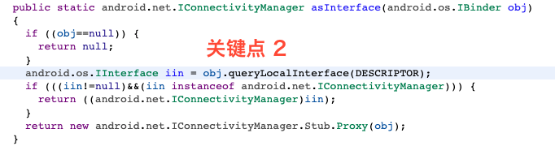

# hook 系统服务

&#x20;我们平时使用  `getSystemService` 时都会依赖 ServiceManager 去获取系统服务，这些服务的本体都在 system\_server 进程中，在应用进程中只有它的 proxy。但可以 hook 掉这些 proxy，从而监听对系统服务的调用。

## getSystemService 调用过程

该方法最终到 ContextImpl#getSystemService()，后者又到 SystemServiceRegistry#getSystemService()。

```java
private static final Map<String, ServiceFetcher<?>> SYSTEM_SERVICE_FETCHERS =
            new ArrayMap<String, ServiceFetcher<?>>();
            
public static Object getSystemService(ContextImpl ctx, String name) {
    if (name == null) {
        return null;
    }
    // 通过 Map 获取到 ServiceFetcher，然后调用 getService()
    final ServiceFetcher<?> fetcher = SYSTEM_SERVICE_FETCHERS.get(name);
    if (fetcher == null) {
        if (sEnableServiceNotFoundWtf) {
            Slog.wtf(TAG, "Unknown manager requested: " + name);
        }
        return null;
    }

    final Object ret = fetcher.getService(ctx);
    
    return ret;
}
```

对于我们例子 ConnectivityManager 来说，它通过  ConnectivityFrameworkInitializer#registerServiceWrappers() 将自己注册到 SYSTEM\_SERVICE\_FETCHERS 中，该方法节选：

<figure><figcaption></figcaption></figure>

registerContextAwareService() 最核心的代码如下：

```java
registerService(serviceName, serviceWrapperClass,
        new CachedServiceFetcher<TServiceClass>() {
            @Override
            public TServiceClass createService(ContextImpl ctx)
                    throws ServiceNotFoundException {
                // createService() 就会调用到注意点1 
                return serviceProducer.createService(
                        ctx.getOuterContext(),
                        // 最终到 ServiceManager, 拿到系统服务在本地的 proxy 对象
                        ServiceManager.getServiceOrThrow(serviceName));
            }});
```

## hook 思路

从上面整个过程可以看出，主要分为两步：

1. 通过 **ServiceManager#getService()** 获取系统服务在本地的 proxy 对象
2. 通过 **Stub.asInterface** 将 proxy 对象传成 aidl 中相应的接口（对于本例就是 IConnectivityManager 接口）供外界使用。asInterface 如下：

<figure><figcaption></figcaption></figure>

因此，如果想要 hook 掉系统调用，只需要影响到【关键点2】处的返回值即可，只要它不返回 null，【关键点2】下面的 if 判断就会成立，传给 ConnectivityManager 就会是我们 hook 掉的对象。同时，由于返回的是一个接口实例，所以可用<mark style="color:red;">**动态代理**</mark>。

由于需要影响 queryLocalInterface() 的返回值，它又属于步骤 1 中的返回对象。反推回来，我们就需要 Hook 掉 ServiceManager#getService() 的结果。

## hook 代码

```java
public void hookSystemServer() {
    try {
        Class<?> serviceManager = Class.forName("android.os.ServiceManager");
        Field sCache = serviceManager.getDeclaredField("sCache");
        sCache.setAccessible(true);
        Map<String, IBinder> o = (ArrayMap<String, IBinder>) sCache.get(null);
        // 拿到原始的 IConnectivityManager 在本进程的 Proxy 对象，它是 BinderProxy 类型
        IBinder originBinderProxy = o.get(Context.CONNECTIVITY_SERVICE);
        // 通过反射调用 asInterface()，主要是为了拿到系统真正传给 ConnectivityManager 的 Proxy 对象，它是 IConnectivityManager 的内部类
        // Proxy 内部执行 BinderProxy，ConnectivityManager 将请求转发给 Proxy，Proxy 再将请求传给 BinderProxy
        // 再由 BinderProxy 通过 binder 驱动调用到系统服务 ConnectivityService
        Method m = Class.forName("android.net.IConnectivityManager$Stub").getMethod("asInterface", IBinder.class);
        m.setAccessible(true);
        // 拿到真正的 Proxy 对象，它的实际类型是 android.net.IConnectivityManager.Stub.Proxy
        Object asI = m.invoke(null, originBinderProxy);
        // 通过动态代理生成一个对象，用于替换掉 sCache 中对应的 BinderProxy
        IBinder newB = (IBinder) Proxy.newProxyInstance(getClassLoader(), new Class[]{IBinder.class}, new InvocationHandler() {
            @Override
            public Object invoke(Object proxy, Method method, Object[] args) throws Throwable {
                method.setAccessible(true);
                Object ret = method.invoke(originBinderProxy, args);
                if (Objects.equals(method.getName(), "queryLocalInterface")) {
                    // 影响 queryLocalInterface() 返回值，返回自己的 IConnectivityManager 对象
                    // 这个对象会传给 ConnectivityManager
                    return Proxy.newProxyInstance(getClassLoader(), new Class[]{Class.forName("android.net.IConnectivityManager")}, new InvocationHandler() {
                        @Override
                        public Object invoke(Object proxy, Method method, Object[] args) throws Throwable {
                            // ConnectivityManager 调用某些方法时最终会到 IConnectivityManager#requestNetwork
                            // 所以可以在此处干自己的事
                            if (Objects.equals("requestNetwork", method.getName())) {
                                new RuntimeException().printStackTrace();
                            }
                            // 拿最原始的 Proxy 对象的返回值
                            return method.invoke(asI, args);
                        }
                    });
                }
                return ret;
            }
        });
        o.put(Context.CONNECTIVITY_SERVICE, newB);
    } catch (Exception e) {
        e.printStackTrace();
    }
}
```
