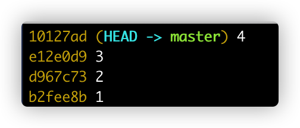
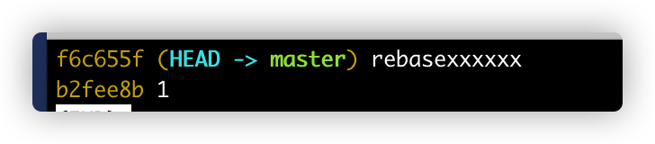

# 操作

1. 使用 **git rebase -i &lt;commitId\>**
2. 弹出界面中，**将要合并的 commit 前的 pick 修改为 s**
3. 弹出新的界面中，输入新的 commit 信息

# 演示

假设当前分支结构如下图：



现在要将 2/3/4 合并到一起，使用如下：

```shell
git rebase -i HEAD~3
```

弹出界面内容如下：

```shell
pick d967c73 2
pick e12e0d9 3
pick 10127ad 4
```

将**后两个 pick 改为 s，表示使用 commit 的内容，但不使用 commit 信息**。最终样式如下：

```shell
pick d967c73 2
s e12e0d9 3
s 10127ad 4
```

在**新界面中输入新 commit 的信息**，然后保存即可生成新的 commit 节点。

最终生成新的 commit 信息如下，其中的 rebasexxxx 就是新的 commit 节点提交信息。

